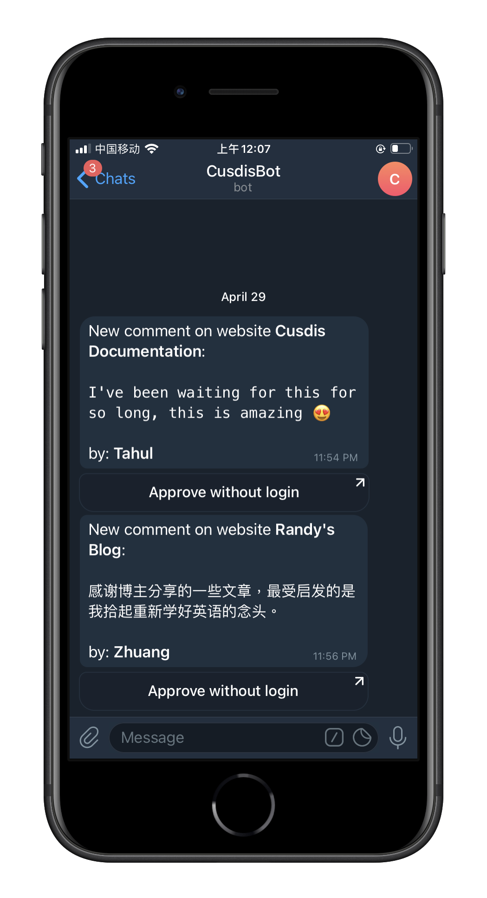

# cusdis-telegram-bot

Official Telegram bot for [Cusdis](https://cusdis.com). (Works on both Cusdis Cloud and self-host Cusdis).

## Usage

1. Open and start bot https://t.me/CusdisBot
2. send `/gethook` command
3. Copy the URL result and paste in Cusdis project's webhook settings

